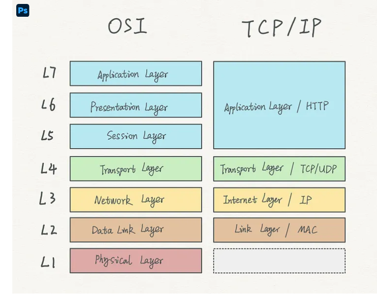

# HTTP & HTTPS

## TODO
- [ X ] breif intro on how it works
- [ ] Realtime application request & resp analysis
- [ ] Security aspects of  this communication
- [ ] Interview questions 
 
 ## Intro
- stateless protocol
    - helps in being fast efficient and reliable 
    - state is maintained using sessions, cookies and tokens in most of webpages
    - Ex login details, chart details

## Client Server model
- Two way communication
- negotiation
###
The client and the server negotiate quite a few things in their headers. For example,

- In the Accept-Charset, they discuss the character encoding options.
- In the Accept-Encoding, they pick which compression algorithm should be used.
- In the Cache-Control, they decide the cache strategy for resources.

### OSI Model & tcp ip model

 we heard about the 7-layer OSI model and 4-layer TCP/IP model.